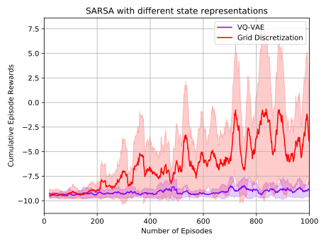
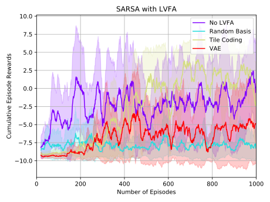
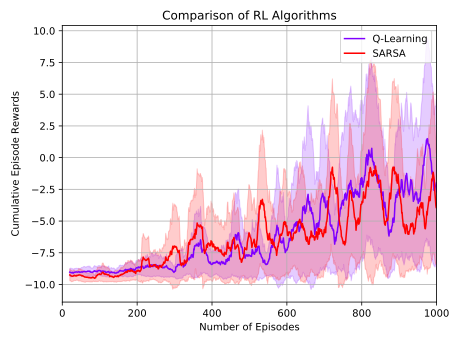
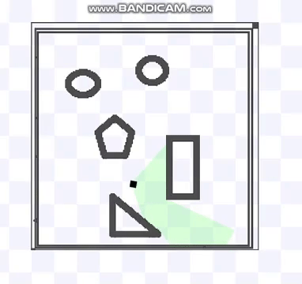

# LIDAR based Obstacle Avoidance with Reinforcement Learning

This project lists all of the deliverables for the TUM project course [Applied Reinforcement Learning](https://www.ldv.ei.tum.de/en/lehre/applied-reinforcement-learning/) (Summer Semester 2019).

## Results
### Reward Graphs:
| State Representation    | Linear Value Function Approximation    | Algorithms    |
| :---------------------: | :------------------------------------: | :-----------: |
|  |  |  |

[More graphs](https://github.com/uzairakbar/rl-obstacle-avoidance/blob/master/assets/reward_graphs).

### Project Demo.:
| Simulation | Real Turtlebot |
| :---------------------: | :------------------------------------: |
|  |  |

### Supplementary Material:
* [Sensor Model Notebook](https://github.com/uzairakbar/rl-obstacle-avoidance/blob/master/src/rl_tb_lidar/src/utils/sensormodel/lidar_sensor_model.ipynb)
* [Auto-Encoders Notebook](https://github.com/uzairakbar/rl-obstacle-avoidance/blob/master/src/rl_tb_lidar/src/utils/autoencoders/vae_experiments.ipynb)
* [Source Code](https://github.com/uzairakbar/rl-obstacle-avoidance/blob/master/src/rl_tb_lidar/src)

## Instructions
1. Move the `rl_tb_lidar` and `stage_ros_u` folders to `catkin_ws/src` directory.
2. run `catkin_make` in the `catkin_ws` directory.
3. Run `source devel/setup.bash` command in the `catkin_ws` directory.
4. Run `roslaunch rl_tb_lidar tb_stage_m1.launch` to launch only stage.
5. Open an another terminal, go to the directory of the python script e.g. `cd ~/catkin_ws/src/rl_tb_lidar/src` and run `python main.py configs/config.yaml`.
5. To try different configurations, edit the `configs/config.yaml` file accordingly.

## Versioning

We version the project with each new deliverable. For the versions available, see the [tags on this repository](https://github.com/uzairakbar/rl-obstacle-avoidance/tags).

## Authors

* **Akbar, Uzair** - [uzair.akbar@tum.de](mailto:uzair.akbar@tum.de)
* **Gundogan, Alperen** - [ga53keb@mytum.de](mailto:ga53keb@mytum.de)
* **Ellouze, Rachid** - [ga63nix@mytum.de](mailto:ga63nix@mytum.de)

See also the list of [contributors](https://github.com/uzairakbar/rl-obstacle-avoidance/graphs/contributors).

## Acknowledgements

* [Dr. Hao Shen](http://www.gol.ei.tum.de/index.php?id=15)
* [Martin Gottwald](http://www.ldv.ei.tum.de/?id=380)
